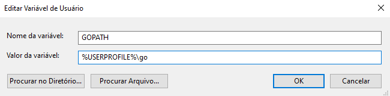
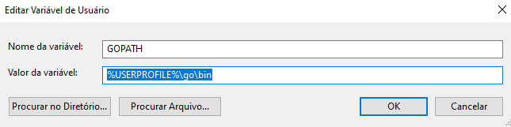

## Instalar Barca no Windows


Olá, seja Bem-Vindo a instalação do Barca para **Desktop** & **CLI** no Windows. Preparamos os melhores conteúdos nesta página para você ficar por dentro dos requisitos necessários, links para download, manual de instalação e outros.

<br>
<br>
<br>

### Barca Desktop


O Barca Desktop é um aplicativo para ambientes Linux, MacOS e Windows que ajuda você na geração de projetos, varreduras em vulnerabilidades, implementação de segurança e suporte de atualizações para ambientes.

<br>
<br>
<br>

### Barca CLI

Simplifique o gerenciamento de infraestruturas e projetos por linha de comando instalando o **Barca CLI** em sua máquina Windows.

Baixe o Barca CLI e mova para o caminho `C:\%USERPROFILE%\go\bin`

Altere a variável de ambiente `GOPATH` em sua máquina adicionando `\bin` no final do valor de sua variável **GOPATH**


<br>
<br>
Altere de
<br>



<br>

Para
<br>



<br>

Caso você queira definir a variável `GOPATH` por linha de comando, basta abrir o Terminal em modo Administrador e executar:

<br>
<br>

```sh
setx GOPATH "%USERPROFILE%\go\bin"
```

<br>
<br>
<br>
<!-- HTML !-->
<button style="background-color: #0a6bff;
  border-radius: 4px;
  border: 0;
  box-shadow: rgba(1,60,136,.5) 0 -1px 3px 0 inset,rgba(0,44,97,.1) 0 3px 6px 0;
  box-sizing: border-box;
  color: #fff;
  cursor: pointer;
  display: inherit;
  font-size: 18px;
  font-weight: 700;
  line-height: 24px;
  margin: 0;
  min-height: 56px;
  min-width: 120px;
  padding: 16px 20px;
  position: relative;
  text-align: center;
  user-select: none;
  -webkit-user-select: none;
  touch-action: manipulation;
  vertical-align: baseline;
  transition: all .2s cubic-bezier(.22, .61, .36, 1)" type="button" >
  Baixar para Windows
</button>

<br>
<br>
<br>
<br>
<br>
<br>


## Instalar Barca no Linux


Linux


<br>
<br>
<br>
<br>
<!-- HTML !-->
<button style="background-color: #0a6bff;
  border-radius: 4px;
  border: 0;
  box-shadow: rgba(1,60,136,.5) 0 -1px 3px 0 inset,rgba(0,44,97,.1) 0 3px 6px 0;
  box-sizing: border-box;
  color: #fff;
  cursor: pointer;
  display: inherit;
  font-size: 18px;
  font-weight: 700;
  line-height: 24px;
  margin: 0;
  min-height: 56px;
  min-width: 120px;
  padding: 16px 20px;
  position: relative;
  text-align: center;
  user-select: none;
  -webkit-user-select: none;
  touch-action: manipulation;
  vertical-align: baseline;
  transition: all .2s cubic-bezier(.22, .61, .36, 1)" type="button" >
  Baixar para Linux
</button>


<br>
<br>
<br>
<br>
<br>
<br>


## Instalar Barca no MacOS

MacOS

<br>
<br>
<br>
<br>
<!-- HTML !-->

<button style="background-color: #0a6bff;
  border-radius: 4px;
  border: 0;
  box-shadow: rgba(1,60,136,.5) 0 -1px 3px 0 inset,rgba(0,44,97,.1) 0 3px 6px 0;
  box-sizing: border-box;
  color: #fff;
  cursor: pointer;
  display: inherit;
  font-size: 18px;
  font-weight: 700;
  line-height: 24px;
  margin: 0;
  min-height: 56px;
  min-width: 120px;
  padding: 16px 20px;
  position: relative;
  text-align: center;
  user-select: none;
  -webkit-user-select: none;
  touch-action: manipulation;
  vertical-align: baseline;
  transition: all .2s cubic-bezier(.22, .61, .36, 1)" type="button" >
  Baixar para MacOS
</button>


<br>
<br>
<br>
<br>
<br>
<br>  
<!-- URL -->


[[toc]]